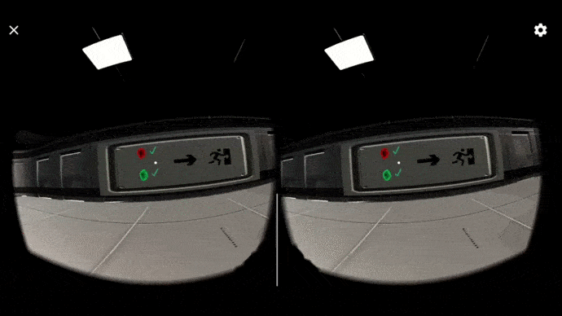

# Proyecto VR: Cyberwork 2077

### **Autores**:
- Florentín Pérez Glez.(alu0101100654)
- Adrián Emilio Padilla Rojas(alu0108558)
- Javier Duque Melguizo (alu0101160337)
- Eduardo Suarez Ojeda (alu0100896565)

# Índice

1. [Introducción](#id1)
2. [Aspectos del juego](#id2)
3. [Cuestiones importantes para el uso](#id3)
4. [Hitos de programación](#id4)
5. [Aspectos que destacarías en la aplicación](#id5)
6. [Gif animados de ejecución](#id6)
7. [Reparto de tareas](#id7)

## Introducción

El proyecto realizado se trata de un juego VR para dispositivos móviles Android al que hemos denominado ***CyberWork2077***. Se trata de un juego fundamentalmente de plataformas y exploración en la que el jugador deberá desenvolverse en distintos entornos hasta alcanzar la victoria, entendida esta como la finalización del juego en sí.

## Aspectos del juego

El juego posee diversas implementaciones y características de interés que serán presentadas a continuación.
- Para jugar al juego hace falta el uso de un controlador compatible con **Bluetooth**. La cámara se desplaza acorde a la cabeza del usuario, mientras el desplazamiento se realiza a través de este dispositivo.
- Al iniciar la aplicación, el jugador se encontrará en un **menú** con distintas opciones. El menú está integrado con VR, por lo que se debe interactuar con el mismo a través de esta tecnología.
- El juego se puede dividir en **distintos niveles y/o mundos**. En cada uno de ellos se le plantea un desafío distinto al judador con objeto de suscitar distintas experiencias y fomentar positivamente la experiencia del usuario.
    - Cada mundo posee una **estética diferente**.
    - Cada mundo tiene sus **propios objetivos**.
    - El acceso a los mundos es **libre** y se puede realizar en el orden que se desee.
    - Al completar los mundos iniciales, se desbloquea un tercero que supone el **reto final** al usuario.
    - Los mundos son, respectivamente: **Bosque**, **Lava**, **Laberinto**.
- No existe manera alguna de perder al juego. En caso de no cumpliri los requisitos de alguno de los niveles desarrollados, el sistema dejará al usuario volver a intentarlo.
- A parte de desplazarse por tierra en cualquier dirección, el jugador también puede **saltar**. Esta es una mecánica fundamental para superar varias de las plataformas presentes a lo largo del videojuego.
- El juego ha sido implementado para ser compatible con **Google Cardoboard**, siguiendo las recomendaciones de diseño oficiales, hallables estas en la página oficial y respectiva a la tecnología.
- Se ha intentado en la medida de lo posible adaptar el juego a las recomendaciones dirigidas a faciltiar la integración del usuario en un entorno virtual.

## Cuestiones importantes para el uso

Para comenzar a abarcar todas estas cuestiones, debemos tener en cuenta que tanto el desarrollo del juego, como su jugabilidad, han sido ideados para poder ser disfrutados mediante las **Google Cardoboard** o cualquier **otras gafas de RV** que puedan suplir su misma función en un dispositivo móvil. Además, el uso de estas es indispensable, ya que la rotación de la cámara del personaje dependerá del eje de visión del jugador.

El otro elemento fundamentental será un **mando**. Su conexión al móvil debe ser posible a traves de bluethooth y, recomendablemente, debe ser de tipo **PS4** o **Xbox**, ya que el botón que se emplea para realizar la opción de salto y movimiento por el menú principal ha sido ideada ser empleada por los botones más estandararizados para dichos mandos (X/A).

### Imagen de la configuración del mando

## Hitos de programación

### ***Menú***

El menú se corresponde con lo primero que verá el jugador cuando inicie la aplicación. Se trata de una serie de opciones entre las que el jugador podrá elegir, siendo estas: "Jugar", "Controles" y "Salir". La primera y tercera opciones son intuitivas y no requieren explicación. La segunda, por su parte, provoca el desglose de una imagen con la configuración de los controles del mando y su efecto en el videojuego. En cuanto a diseño y estética, el menú muestra el título del juego sobre una serie de imágenes en movimiento de uno de los nivles del videojuego (administradas estas a través de un script), mientras, simultaneamente suena una pieza musical de acompañamiento. En cuanto a implementación, el menú se trata de un canvas que cubre la cámara principal y con el que el jugador puede interactuar a través de "Raycasting". 

### ***Lobby***

El primer entorno con el que podrá interactuar el jugador después del menú es una "zona central" desde la cual el jugador podrá elegir el mundo que desea empezar. Las conexiones a dichos mundos se realiza a través de una serie de portales que se ubican detrás de unas puertas que reaccionarán cuando el jugador se acerque abriéndose. Existe un total de dos portales, uno verde y otro rojo, y que comunican con los mundos "Bosque" y "Lava" respectivamente. Adicionalmente, en esta zona, cuya apariencia se asemeja al interior de una nave espacial, el jugador podrá ver un panel que marca el progreso de los mundos que ha superado. Cuando lo hayan sido, una tercera puerta, antes bloqueada, será transitable por el jugador, permitiendo inicial el nivel "Laberinto".

### **Mundo ***Bosque*****

Este mundo se caracteriza por una ambientación de tipo *bosque alegre de fantasía*, donde se puede apreciar numerosos detalles ambientales, entre ellos los que destacan son:

* Distintos tipos de árboles.
* Champiñones.
* Rocas.
* Flores y hierba.
* Una casa.

El objetivo del jugador en este lugar es recolectar cinco champiñones dorados. Los dos primeros son muy obvios, y están pensados para que familiarizarnos con el sistema de recolección, pero los siguientes solo serán accesibles a través de un recorrido de plataformas.

Una vez completadas las tareas, aparecerá un nuevo portal de color morado que, al ser atravesado, se interpretará como que el nivel ha sido superado.

### **Mundo ***Lava*****

En este mundo el jugador se encontrará en un entorno similar al crater de un volcán. En entorno, predominantemente rocoso, destaca por un elemento en concreto, ubicado este a los pies del jugador; un lago de lava ascendente que, de contactar con el jugador supondrá su derrota en el mundo (que podrá reintentar cuantas veces desee). Para superer este nivel, el usario deberá llegar a un portal de salida antes de que la lava lo engulla. Para ello, no le bastará con ser simplemente rápido, sino también hábil, ya que el usuario deberá ser capaz de superar varias plataformas correctamente si no quiere que un movimiento en falso provoque su precipitación sobre la lava.

Las plataformas mantienen todas formas distintas, además de las distancias de separación objeto de provocar variación a lo largo del desafío. Adicionalmente, algunas de ellas son móviles. Si el jugador llegara a colisionar con estas en su movimiento, se vería irremediablemente empujado a la lava.

### **Mundo ***Laberinto*****

Este mundo, accesible directamente desde el *Lobby* una vez se han completado los otros dos niveles descritos anteriormente, consiste, como su nombre indica, en sortear un laberinto generado proceduralmente usando el algoritmo *'HuntAndKill'*, un algoritmo de generación de laberintos rectangulares que describen cuadriculas y que tiene la ventaja de asegurar que todos los caminos que se creen en el laberinto, se encontraran conectados y por lo tanto, accesibles, maximizando el uso del espacio asignado al laberinto en su generación. A continuación, un ejemplo de generación de laberinto aplicando el algoritmo:

A modo de documentación, el script responsable de la generación del laberinto recibe de argumento ('cell prefab') un **prefab** que debe contener cuatro **GameObject** (que representen muros) con los siguientes nombres:

* Wall-North
* Wall-East
* Wall-South
* Wall-West

Estos nombres son importantes, pues es la forma que tiene el algoritmo de saber que muros 'tumbar' en su trayecto cada vez que elige al azar una de las cuatro direcciones disponible.

**Antes de iniciar el juego**

**Después de iniciar el juego**

### ***Sonido***

Todos los sonidos que hemos incluido en el juego han sido establecidos gracias de la herramienta *AudioClip*, siendo asignados a cada uno de los objetos en los que se realiza una interacción. Es por ello por lo que en ciertos casos (como al atravesar portales o tocar la lava), el evento correspondiente no ocurre directamente, sino que se espera a la finalización del clip de audio para su ejecución.

### ***Gestión de eventos***

Debido a la naturaleza del videojuego desarrollado y los géneros en los que este se puede categorizar, no nos ha resultado necesario la realización de ningún evento propio. En su lugar, nos hemos bastado con los incluídos nativamente en Unity y ligados a sus componentes, especialmente "Collider". Eventos como ***OnColliderEnter*** son utilizados para gestionar la apertura de puertas y el funcionamiento general de los portales. Así mismo, y en la misma sintonía, ***OnColliderExit*** es utilizado para determinar cuando es necesario cerrarlas.

***OnTriggerEnter*** se utiliza en ***Mundo Lava*** para gestionar el contacto del jugador con el elemento principal del nivel que da nombre al mismo. 

Por su parte, en ***Mundo Bosque*** se emplea ***OnPointerEnter*** para la recolección de los champiñones necesarios para superar el nivel.

## Aspectos que destacarías en la aplicación. Especificar si se han incluido sensores de los que se han trabajado en interfaces multimodales.

Los aspectos que consideramos positivos en el juego, y que están vinculados con la experiencia de usuario en un entorno VR, son los siguientes:

* Darle la posibilidad al jugador de iniciar la partida cuando este se considere preparado.

* Evitar el uso de texto en el juego, posibilitando así que una mayor cantidad de personas puedan disfrutarlo, la información dada esta establecida a través de imágenes.

* Baja sención de mareo, esto ha sido posible gracias a la evasión de movimientos bruscos en la cabeza, podría pensarse que al tratarse de un juego de plataformas los movimientos de esta serían frecuentes, pero lo hemos evitado adaptando el tamaño de los obstaculos a las circunstancias.

* El uso de colores no brillantes, para evitar dañarle la vista al jugador.

* El sonido al atravesar portales nos sirve para suavizar el cambio de escenas, ya que, advierte de lo que va a ocurrir, y solo se dá cuando termina la reproducción de este.

* La camara no se mueve sin la propia intención del usuario. Esta siempre estará vinculada al mismo, ya que si se desplazase por la escena para mostrar diferentes elementos en la misma, se podría producir sensación de mareo.

Hemos de destacar, además, la nula implementación de sensores en el videojuego fundamentalmente debido a que, bajo nuestra percepción, resultan poco útiles para la misma por diversos motivos, siendo el principal que desfavorecían la experiencia de usuario en un entorno VR. Sensores como el acelerómetro implicarían la necesidad de que el jugador se desplazara (con los ojos tapados por la VR) si se plantea captar alguna medida. Otros, como el GPS, aportan una medida inicial que de difícil manera se podría trasladar a una aplicación de nuestras características.

## Gif animados de ejecución

Esta es la pantalla que aparece al iniciar la aplicación.

Se puede acceder a controles para comprobar los botones del mando que serán empleados en el juego.

Al darle a jugar apareceremos en la sala principal, en ella encontraremos un cartel que nos explicará cual es nuestra misión.

Seleccionarémos una de las dos puertas para dar comienzo a nuestra aventura, en este caso se trata del mundo del **bosque**.

Dentro de este mundo nuestra misión será **recolectar 5 champiñones dorados**, el primero de ellos se encontrará en la parte trasera del comienzo del nivel.

El segundo de ellos lo tomaremos del cartel explicativo de la misión.

El tercero se encotrará sobre el árbol de la colina, tanto este como el siguiente serán recogidos a través de un circuito de plataformas.

El cuarto se hallará en la cima de las plataformas.

El último se conseguirá a través de otro recorrido de plataformas, este nos guiará hacia una cabaña donde encontraremos un agujero que, al dejarnos caer por él, accederemos a un portal que nos conducirá al último champiñon.

Después de completar este nivel, atravesando su portal morado correspondiente, será hora de pasar al mundo de la **lava**.

Como comentabamos anteriormente, nuestra misión será la de escapar de la lava atravesando el siguiente circuito de obstáculos.

Por último, volverémos a la sala principal donde verémos que todos los desafios han sido completados y podrémos acceder a la sala final.

Ya solo restará completar el laberinto aleatorio que se haya generado.

## Reparto de tareas

- Adrián Emilio Padilla Rojas.
    - Realización "Menú inicial".
    - Implementación de sonidos.
    - Creación zona "Lobby".
    - Desarrollo parcial de "Mundo Bosque".
        - Estética.
        - Planteamiento del nivel.
        - Gestión de coleccionables (objetos a recolectar).
- Florentín Pérez González.
    - Realización completa de "Mundo Lava".
        - Diseño del nivel.
        - Creación del entorno.
        - Plataformas del nivel.
    - Coordinación general del proyecto.
    - Construcción APK y solución de errores vinculantes.

- Javier Duque Melguizo.
    - Realización completa de "Mundo Laberinto".
        - Planteamiento del nivel.
        - Diseño del nivel.
        - Creación del entorno.
        - Script de generación procedural.
    - Configuración de controles.
    - Pantalla de muestro de los mismos (Opción "Controles" del menú)

- Eduardo Suarez Ojeda.
    - Configuración VR.
    - Apoyo general a todas las partes, junto a solución de bugs y testeo de la aplicación.
    - Desarrollo parcial "Mundo Bosque".
        - Plataformas del nivel.
        - Modelaje de la escena.
        - GameObjects de la escena.
    - Gestión de portales (conectores entre niveles).

- Común.
    - Gestión de eventos.
    - Realización e implementación de scripts.
    - Realización del informe.
    - Búsqueda de utilidades y assets en internet.
    - Planteamiento inicial del proyecto (decisión de la temática entre otras cuestiones).

### ***Enlaces de interés***

* [Acceso a los Scripts desarrollados](Scripts)
* [Google drive con el proyecto y el APK](https://drive.google.com/drive/folders/1CCyCUuU9NQ2yr_v39SfyQvMMqZyD5TxO?usp=sharing)
